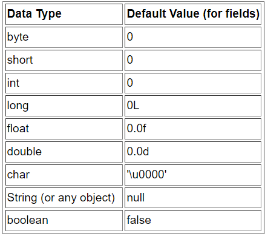

# Java

##  Java基础

### 1. 为什么Java代码可以实现一次编写、到处运行?

JVM 是Java跨平台的关键。

在程序运行前，Java源代码 (.java) 需要经过编译器编译成字节码(.class) 。在程序运行时，JVM负责将字节码翻译成特定平台下的机器码并运行。即只要在不同的平台上安装对应的JVM，就可以运行字节码文件。

同份Java源代码在不同的平台上运行，它不需要做任何的改变，并且只需要编译一次。 而编译好的字节码，是通过JVM这个中间的“桥梁”实现跨平台的，JVM是与平台相关的软件，它能将统一的字节码翻译成该平台的机器码。

### 2. 一个Java文件里可以有多个类吗（不含内部类） ?

- 一个java文件里可以有多个类，但最多只能有一个被public修饰的类
- 如果这个java文件中包含public修饰的类，则这个类的名称必须和java文件名-致

### 3. Java访问权限

Java语言为我们提供了三种访问修饰符，即private、 protected、 public, 在使用这些修饰符修饰目标时，一共可以形成四种访问权限，即private、 default、 protected、 public, 在不加任何修饰符时为default访问权限。

1. 在修饰成员变量/成员方法时，该成员的四种访问权限的含义如下:
    - private: 该成员可以被该类内部成员访问
    - default: 该成员可以被该类内部成员访问，也可以被同一包下其他的类访问
    - protected: 该成员可以被该类内部成员访问，也可以被同一包下其他的类访问，还可以被它的子类访问
    - public: 该成员可以被任意包下，任意类的成员进行访问
2. 在修饰类时，该类只有两种访问权限，对应的访问权限的含义如下:
    - default: 该类可以被同一包下其他的类访问
    - public: 该类可以被任意包下，任意的类所访问

### 4.  Java数据类型

- Java数据类型包括基本数据类型和引用数据类型两大类
- 基本数据类型有8个，在这8个基本类型当中，除了布尔类型之外的其他7个
  类型，都可以看做是数字类型，它们相互之间可以进行类型转换。类型大小：

| 类型    | 位                                              | 字节 |
| ------- | ----------------------------------------------- | ---- |
| byte    | 8                                               | 1    |
| short   | 16                                              | 2    |
| int     | 32                                              | 4    |
| long    | 64                                              | 8    |
| double  | 64                                              | 8    |
| float   | 32                                              | 4    |
| char    | 16                                              | 2    |
| boolean | Java规范无明确的规定，不同的JVM有不同的实现机制 | \    |

基本数据类型默认值：

- 引用类型就是对一个对象的引用，默认值为null，根据引用对象类型的不同，可以将引用类型分为3类，即数组、类、接口类型。引用类型本质上就是通过指针，指向堆中对象所持有的内存空间，只是Java语言不再沿用指针这个说法而已。

### 5.  Java是值传递还是引用传递？

Java是值传递。当传的是基本类型时，传的是值的拷贝，对拷贝变量的修改不影响原变量；当传的是引用类型时，传的是引用地址的拷贝，但是拷贝的地址和真实地址指向的都是同一个真实数据，因此可以修改原变量中的值

### 6. 成员变量和局部变量的区别？

Java中的变量分为成员变量和局部变量，它们的区别如下:

- 成员变量：
    1. 成员变量是在类的范围里定义的变量
    2. 成员变量有默认初始值
    3. 未被static修饰的成员变量也叫实例变量，它存储于对象所在的堆内存中，生命周期与对象相同
    4. 被static修饰的成员变量也叫类变量，它存储于方法区中，生命周期与当前类相同

- 局部变量：
    1. 局部变量是在方法里定义的变量
    2. 局部变量没有默认初始值
    3. 局部变量存储于栈内存中，作用的范围结束，变量空间会自动释放

### 7. 为什么要有包装类？

Java语言是面向对象的语言，其设计理念是"一切皆对象”。但8种基本数据类型不具备对象的特性。正是为了解决这个问题，Java为每个基本数据类型都定义了一个对应的引用类型，即包装类

### 8.  自动装箱和自动拆箱是什么？

- 自动装箱：把一个基本类型的数据直接赋值给对应的包装类型
- 自动拆箱：把一个包装类型的对象直接赋值给对应的基本类型

### 9. int和Integer进行==运算会得到什么结果？

int是基本数据类型，Integer 是int的包装类。二者在做==运算时，Integer会自动拆箱为int类型，然后再进行比较。届时，如果两个int值相等则返回true，否则就返回false

### 10. 面向对象三大特征？

面向对象的程序设计方法具有三个基本特征:封装、继承、多态。

- 封装：指的是将对象的实现细节隐藏起来，然后通过一些公用方法来暴露该对象的功能
- 继承：面向对象实现软件复用的重要手段，当子类继承父类后，子类作为种特殊的父类，将直接获得父类的属性和方法
- 多态：子类对象可以直接赋给父类变量，但运行时依然表现出子类的行为特征，这意味着同一个类型的对象在执行同一个方法时，可能表现出多种行为特征

### 11. 对多态的理解？

因为子类其实是一种特殊的父类，因此Java允许把一个子类对象直接赋给一个父类引用变量， 无须任何类型转换，或者被称为向上转型，向上转型由系统自动完成。

当把一个子类对象直接赋给父类引用变量时，例如BaseClass obj = new SubClassO);，这个obj引用变量的编译时类型是BaseClass,而运行时类型是SubClass，当运行时调用该引用变量的方法时，其方法行为总是表现出子类方法的行为特征，而不是父类方法的行为特征，这就可能出现：相同类型的变量、调用同一个方法时呈现出多种不同的行为特征，这就是多态。多态可以提高程序的可扩展性，在设计程序时让代码更加简洁优雅

### 12. Java为什么是单继承？

Java是单继承的，指的是Java中一个类只能有一个直接的父类。Java不能多继承， 则是说Java中一个类不能直接继承多个父类

Java在设计时借鉴了C++的语法，而C++是支持多继承的。Java语言之所以摒弃了多继承的这项特征，是因为多继承容易产生混淆。比如，两个父类中包含相同的方法时，子类在调用该方法或重写该方法时就会迷惑

准确来说，Java是可以实现"多继承"的。因为尽管一个类只能有一个直接父类， 但是却可以有任意多个间接的父类。这样的设计方式，避免了多继承时所产生的混淆。

### 13.  重写和重载的区别？

- 重载发生在同一个类中，若多个方法之间方法名相同、参数列表不同，则它们构成重载的关系。重载与方法的返回值以及访问修饰符无关，即重载的方法不能根据返回类型进行区分
- 重写发生在父类子类中，若子类方法想要和父类方法构成重写关系，则它的方法名、参数列表必须与父类方法相同。另外，返回值要小于等于父类方法，抛出的异常要小于等于父类方法，访问修饰符则要大于等于父类方法
- 若父类方法的访问修饰符为private，则子类不能对其重写

### 14. 构造方法能不能重写？

构造方法不能重写。因为构造方法需要和类保持同名，而重写的要求是了类方法要和父类方法保持同名。如果允许重写构造方法的话，那么子类中将会存在与类名不同的构造方法，这与构造方法的要求是矛盾的

### 15. Object类中的常用方法？

- Class<?> getClass()：返回该对象的运行时类
- boolean equals(Object obj)：判断指定对象与该对象是否相等
- int hashCode()：返回该对象的hashCode值。在默认情况下，Object类根据该对象的地址来计算哈希值
- String toString()：返回该对象的字符串表示。Object类的toString()方法返回 运行时类名@十六进制hashCode值格式的字符串
- Object类还提供了wait()、 notify()、 notifyAll()这几个方法，通过这几个方法可以控制线程的暂停和运行
- Object类还提供了一个clone()方法，该方法用于帮助其他对象来实现"自我克隆"，所谓"自我克隆"就是得到一个当前对象的副本，而且二者之间完全隔离。由于该方法使用了protected修饰，因此它只能被子类重写或调用
- Object类还提供了一-个finalize()方法， 当系统中没有引用变量引用到该对象时，垃圾回收器调用此方法来清理该对象的资源。并且，针对某一个对象，垃圾回收器最多只会调用它的finalize()方法一次。但是此方法是否调用以及何时调用都是不确定的，这个方法不推荐使用

### 16.  为什么要重写hashCode()和equals()？

hashCode()用于获取哈希码(散列码)，eauqls()用于比较两个对象是否相等，它们应遵守如下规定:

- 如果两个对象相等，则它们必须有相同的哈希码
- 如果两个对象有相同的哈希码，则它们未必相等

由于hashCode()与equals()具有联动关系所以equals()方法重写时，通常也要将hashCode()进行重写，使得这两个方法始终满足相关的约定

### 17.  == 和 equals()的区别？

1. ==
    - 作用于基本数据类型时，是比较两个数值是否相等
    - 作用于引用数据类型时，是比较两个对象的内存地址是否相同，即判断它们是否为同一个对象
2. equals():
    - 没有重写时，Object默认以==来实现，即比较两个对象的内存地址是否相同
    - 进行重写后，一般会按照对象的内容来进行比较，若两个对象内容相同则认为对象相等，否则认为对象不等

### 18. 列举String类的几个常用方法？

- char charAt(int index)：返回指定索引处的字符
- String substring(int beginIndex, int endIndex)：从此字符串中截取出一部分子字符串
- String[] split(String regex)：以指定的规则将此字符串分割成数组
- String trim()： 删除字符串前导和后置的空格
- int indexOf(String str)：返回子串在此字符串首次出现的索引
- int lastIndexOf(String str)：返回子串在此字符串最后出现的索引
- boolean startsWith(String prefix)：判断此字符串是否以指定的前缀开头
- boolean endsWith(String suffix)：判断此字符串是否以指定的后缀结尾
- String toUpperCase()：将此字符串中所有的字符大写
- String toLowerCase()：将此字符串中所有的字符小写
- String replaceFirst(String regex, String replacement)：用指定字符串替换第一个匹配的子串
- String replacel(String regex, String replacement)：用指定字符串替换所有的匹配的子串

### 19. String不可变性及好处？

- String被声明为final,因此它不可变、不可被继承。内部使用char数组存储数据（Java9之前采用char[]数组，之后使用byte[]数组），该数组被声明为final,这意味着value数组初始化之后就不能再引用其它数组。并且String内部没有改变value数组的方法，因此可以保证String不可变

- 不可变的好处：

    1. 可以缓存hash值：因为String 的hash值经常被使用，例如String用做HashMap的key。不可变的特性可以使得hash值也不可变，因此只需要进行一次计算

    2. String Pool的需要：如果一个String对象已经被创建过了，那么就会从String Pool中取得引用。只有String 是不可变的，才可能使用String Pool
    3. 安全性：String经常作为参数, String 不可变性可以保证参数不可变。例如在作为网络连接参数的情况下如果String是可变的，那么在网络连接过程中，String被改变,改变String对象的那一方以为现在连接的是其它主机，而实际情况却不一定是
    4. 线程安全：String不可变性天生具备线程安全，可以在多个线程中安全地使用

### 20.  String、StringBuffer、StringBuilder区别？

- String 不可变，StringBuffer 和StringBuilder可变
- String 不可变，因此是线程安全的。StringBuilder 不是线程安全的，StringBuffer 是线程安全的，内部使用synchronized进行同步
- 单线程情况下，使用StringBuilder比StringBuffer性能要高

### 21.  “hello”和new String(“hello”)区别？

- JVM会使用常量池来管理字符串直接量。在执行这句话时，JVM会先检查常量池中是否已经存有"hello" ，若没有则将"hello"存入常量池，否则就复用常量池中已有的"hello"，将其引用赋值给变量
- 当使用new String("hello") 时，JVM会先使用常量池来管理"hello"直接量，再调用String类的构造器来创建一个新的String对象， 新创建的String对象被保存在堆内存中，并且堆中对象的数据会指向常量池中的直接量

​	显然，采用new的方式会多创建一个对象出来，会占用更多的内存，所以一般建议使用直接量的方式创建字符串

### 22. 字符串拼接

字符串拼接有多种形式，最常用的有+、StringBuffer、StringBuilder、String类的concat()方法：

1. 采用+运算符拼接字符串时：
    - 如果拼接的都是字符串直接量，则在编译时编译器会将其直接优化为个完整的字符串，和你直接写一个完整的字符串是一样的， 所以效率非常高
    - 如果拼接的字符串中包含变量，则在编译时编译器采用StringBuilder对其进行优化，即自动创建。StringBuilder实例并调用其append()方法，将这些字符串拼接在一起，效率也很高。但如果这个拼接操作是在循环中进行的，那么每次循环编译器都会创建一个StringBuilder实例， 再去拼接字
      符串，相当于执行了new StringBuilder().append(str)，所以此时效率很低
2. 采用StringBuilder/StringBuffer拼接字符串时：
    - StringBuilder/StringBuffer都有字符串缓冲区， 缓冲区的容量在创建对象时确定，并且默认为16。当拼接的字符串超过缓冲区的容量时，会触发缓冲区的扩容机制，即缓冲区加倍
    - 缓冲区频繁的扩容会降低拼接的性能，所以如果能提前预估最终字符串的长度，则建议在创建可变字符串对象时，放弃使用默认的容量，可以指定缓冲区的容量为预估的字符串的长度
3. 采用String类的concat方法拼接字符串时：
    - concat方法的拼接逻辑是， 先创建一个足以容纳待拼接的两个字符串的字节数组， 然后先后将两个字符串拼到这个数组里，最后将此数组转换为字符串
    - 在拼接大量字符串的时候，concat方法的效率低于StringBuilder。但是只拼接2个字符串时，concat方法的效率要优于StringBuilder。并且这种拼接方式代码简洁，所以只拼2个字符串时建议优先选择concat方法

### 23. 抽象类和接口的区别？

- 从设计层面上看，抽象类提供了一种IS-A关系，那么就必须满足里式替换原则，即子类对象必须能够替换掉所有父类对象。而接口更像是一种LIKE-A关系，它只是提供一种方法实现契约, 并不要求接口和实现接口的类具有IS-A关系
- 从使用上来看，一个类可以实现多个接口，但是不能继承多个抽象类
- 接口的字段只能是static和final类型的，而抽象类的字段没有这种限制
- 接口的成员只能是public的，而抽象类的成员可以有多种访问权限

### 24. Java异常处理机制？

- 关于异常处理：
  在Java中，处理异常的语句由try、catch、 finally三部分组成。 其中，try块用于包裹业务代码，catch块用于捕获并处理某个类型的异常，finally块则用于回收资源。当业务代码发生异常时，系统会创建一个异常对象，然后由JVM寻找可以处理这个异常的catch块，并将异常对象交给这个catch块处理。若业务代码打开了某项资源，则可以在finally块中关闭这项资源，因为无论是否发生异常，finally块一定会执行
- 关于抛出异常：
  当程序出现错误时，系统会自动抛出异常。除此以外，Java也允许程序主动抛出异常。当业务代码中，判断某项错误的条件成立时，可以使用throw关键字向外抛出异常。在这种情况下，如果当前方法不知道该如何处理这个异常，可以在方法签名上通过throws关键字声明抛出异常，则该异常将交给JVM处理
- 关于异常跟踪栈：
  程序运行时，经常会发生一系列方法调用，从而形成方法调用栈。异常机制会导致异常在这些方法之间传播，而异常传播的顺序与方法的调用相反。异常从发生异常的方法向外传播，首先传给该方法的调用者，再传给上层调用者，以此类推。最终会传到main方法，若依然没有得到处理，则JVM会终止程序并打印异常跟踪栈的信息

### 25. Java异常处理接口？

- Throwable是异常的顶层父类，代表所有的非正常情况。它有两个直接子类，分别是Error、Exception
- Error是错误，一般是指与虚拟机相关的问题，如系统崩溃、虚拟机错误、 动态链接失败等，这种错误无法恢复或不可能捕获，将导致应用程序中断。通常应用程序无法处理这些错误，因此应用程序不应该试图使用catch块来捕获Error对象。在定义方法时，也无须在其throws子句中声明该方法可能抛出
  Error及其任何子类
- Exception是异常，它被分为两大类，分别是Checked异常和Runtime异常。 所有的RuntimeException类及其子类的实例被称为Runtime异常；不是RuntimeException类及其子类的异常实例则被称为Checked异常。Java认为Checked异常都是可以被处理 (修复)的异常，所以Java程序必须显式处理
  Checked异常。如果程序没有处理Checked异常， 该程序在编译时就会发生错误，无法通过编译。Runtime异常则更加灵活，Runtime异常无须显式声明抛出，如果程序需要捕获Runtime异常，也可以使用try...catch块来实现

### 26.  try... catch...finally执行流程？

当Java程序执行try、catch块时遇到了return或throw语句，这两个语句都会导致该方法立即结束，但是系统执行这两个语句并不会结束该方法，而是去寻找该异常处理流程中是否包含finally块，如果没有finally块，程序立即执行retum或throw语句，方法终止；如果有finally块， 系统立即开始执行finally块。只有当finally块执行完成后，系统才会再次跳回来执行try块、catch块里的return或throw语句；如果finally块里也使用了return或throw等导致方法终止的语句，finally块已经终止了方法，系统将不会跳回去执行try块、catch块 里的任何代码

### 27. static和final的区别？

1. static关键字可以修饰成员变量、成员方法、初始化块、内部类，被static修饰的成员是类的成员，它属于类、不属于单个对象。以下是static修饰这4种成员时表现出的特征:
    - 类变量：被static修饰的成员变量叫类变量(静态变量)。类变量属于类，它随类的信息存储在方法区，并不随对象存储在堆中，类变量可以通过类名来访问，也可以通过对象名来访问，但建议通过类名访问它
    - 类方法：被static修饰的成员方法叫类方法 (静态方法)。类方法属于类，可以通过类名访问，也可以通过对象名访问，建议通过类名访问它
    - 静态块：被static修饰的初始化块叫静态初始化块。静态块属于类，它在类加载的时候被隐式调用一次，之后便不会被调用了
    - 静态内部类：被static修饰的内部类叫静态内部类。静态内部类可以包含静态成员，也可以包含非静态成员。静态内部类不能访问外部类的实例成员，只能访问外部类的静态成员。外部类的所有方法、初始化块都能访问其内部定义的静态内部类
2. finaI关键字可以修饰类、方法、变量，以下是final修饰这3种目标时表现出的特征：
    - final类: final关键字修饰的类不可以被继承
    - final方法: final关键字修饰的方法不可以被重写
    - final变量: final关键字修饰的变量，一旦获得了初始值，就不可以被修改。
3. 补充
    - 变量分为成员变量、局部变量
    - final修饰成员变量：
        - 类变量:可以在声明变量时指定初始值，也可以在静态初始化块中指定初始值
        - 实例变量:可以在声明变 量时指定初始值，也可以在初始化块或构造方法中指定初始值
    - fina修饰局部变量:
        - 可以在声明变量时指定初始值，也可以在后面的代码中指定初始值
        - 注意：被final修饰的任何形式的变量，一旦获得了初始值，就不可以被修改

### 28. 泛型和泛型擦除？

- 从ava 5开始，Java引入了“参数化类型”的概念，允许程序在创建集合时指定集合元素的类型，Java的参数化类型被称为泛型(Generic) 。例如List<String>,表明该List只能保存字符串类型的对象。
- 在严格的泛型代码里，带泛型声明的类总应该带着类型参数。但为了与老的Java代码保持一致，也允许在使用带泛型声明的类时不指定实际的类型。如果没有为这个泛型类指定实际的类型，此时被称作raw type (原始类型)，默认是声明该泛型形参时指定的第一个上限类型。当把一个具有泛型信息的对象赋给另一个没有泛型信息的变量时，所有在尖括号之间的类型信息都将被
  扔掉。比如一个List<String> 类型被转换为List,则该List对集合元素的类型检查变成了泛型参数的上限(即Object) 。泛型擦除发生在编译时期

### 29.  List<? super T>和List<? extends T>有什么区别？

- ?是类型通配符，List<?> 可以表示各种泛型List的父类，意思是元素类型未知的List
- List<? super T>用于设定类型通配符的下限，此处?代表一个末知的类型， 但它必须是T的父类型
- List<? extends T>用于设定类型通配符的上限，此处?代表一个末知的类型，但它必须是T的子类型

### 30. Java反射的理解？

Java程序中的对象在运行时可以表现为两种类型，即编译时类型和运行时类型。例如Person p = new Student();，这行代码将会生成一个p变量， 该变量的编译时类型为Person,运行时类型为Student。有时，程序在运行时接收到外部传入的一个对象，该对象的编译时类型是0bject,但程序又需要调用该对象的运行时类型的方法。这就要求程序需要在运行时发现对象和类的真实信息，而解决这个问题有以下两种做法:

- 第一种做法是假设在编译时和运行时都完全知道类型的具体信息，在这种情况下，可以先使用instanceof运算符进行判断，再利用强制类型转换将其转换成其运行时类型的变量即可
- 第二种做法是编译时根本无法预知该对象和类可能属于哪些类，程序只依靠运行时信息来发现该对象和类的真实信息，这就必须使用反射

具体来说，通过反射机制，我们可以实现如下的操作:

- 程序运行时，可以通过反射获得任意一个类的Class对象，并通过这个对象查看这个类的信息
- 程序运行时，可以通过反射创建任意一个类的实例， 并访问该实例的成员
- 程序运行时，可以通过反射机制生成一个类的动态代理类或动态代理对象

### 31.  Java反射在实际项目中有哪些应用场景?

Java的反射机制在实际项目中应用广泛，常见的应用场景有:

- 使用JDBC时，如果要创建数据库的连接，则需要先通过反射机制加载数据库的驱动程序
- 多数框架都支持注解/XML配置，从配置中解析出来的类是字符串，需要利用反射机制实例化
- 面向切面编程 (AOP)的实现方案， 是在程序运行时创建目标对象的代理类，这必须由反射机制来实现

### 32. Java四种引用方式？

Java对象的四种引用方式分别是强引用、软引用、弱引用、虛引用，具体含义如下：

- 强引用：这是Java程序中最常见的引用方式，即程序创建一个对象，并把这个对象赋给一个引用变量，程序通过该引用变量来操作实际的对象。当一个对象被一个或一个以上的引用变量所引用时，它处于可达状态，不能被系统垃圾回收机制回收
- 软引用：当一个对象只有软引用时，它有可能被垃圾回收机制回收。对于只有软引用的对象而言，当系统内存空间足够时，它不会被系统回收，程序也可使用该对象。当系统内存空间不足时，系统可能会回收它。软引用通常用于对内存敏感的程序中
- 弱引用：弱引用和软引用很像，但弱引用的引用级别更低。对于只有弱引用的对象而言，当系统垃圾回收机制运行时，不管系统内存是否足够，总会回收该对象所占用的内存。当然，并不是说当一个对象只有弱引用时，它就会立即被回收，正如那些失去引用的对象一样，必须等到系统垃圾回收机制运行时才会被回收
- 虚引用：虚引用完全类似于没有引用。虚引用对对象本身没有太大影响，对象甚至感觉不到虚引用的存在。如果一个对象只有一个虚引用时，那么它和没有引用的效果大致相同。虚引用主要用于跟踪对象被垃圾回收的状态，虚引用不能单独使用，虚引用必须和引用队列联合使用

-----

